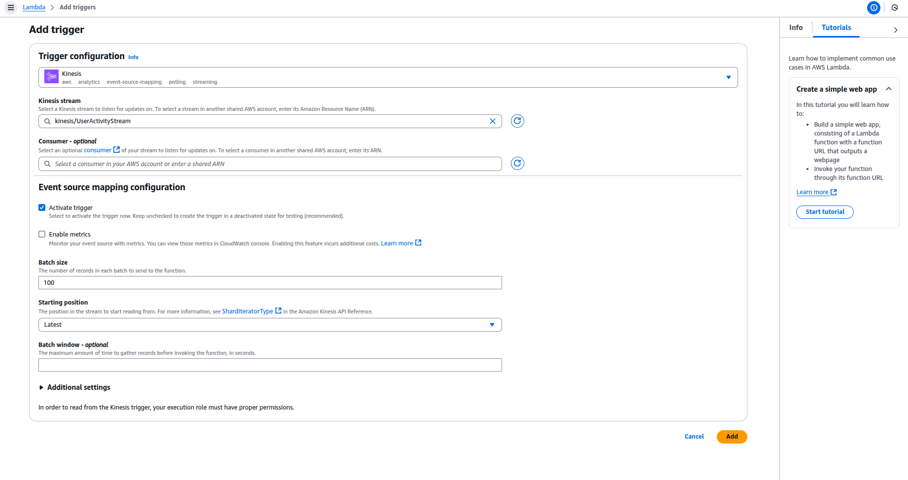

# Real-Time Data Processing

This project demonstrates how to implement a real-time data processing system using AWS services. It covers steps from data ingestion to visualization.

---

## Architecture Overview

The architecture includes:
- **Amazon Kinesis Data Streams** for real-time data ingestion.
- **AWS Lambda** for data processing (from Kinesis to S3).
- **Amazon S3** for data storage.
- **AWS Glue** for schema discovery.
- **Amazon Athena** for querying data.
- **Amazon QuickSight** for visualization.

---

## Steps to Implement

### 1. Amazon Kinesis
- Create a Kinesis stream to collect user data.

- Example of data to send to Kinesis - [data-format.json](kinesis/data-format.json)

### 2. Amazon S3
- Configure S3 bucket where the data sent to Kinesis will be stored.

[bucket_policy.json](s3/bucket_policy.json)
- Configure S3 bucket where the Athena queries will be stored.

### 3. AWS Lambda
- Configure a Lambda function to process data from Kinesis and store it in S3.
1. Create the function and set up permissions

2. Paste the Lambda code - [code.py](lambda/code.py)

3. Add ENV variable of the bucket name.

4. Add Kinesis as a Lambda trigger.

### 4. AWS Glue
- Set up a Glue crawler to discover the schema of the data in S3 and register it in the Glue Data Catalog to query the data in Athena in the future.
1. Set up permissions.

2. Add the schema database and set up glue crawler to register the S3 schema.

### 5. Send test data to Kinesis
- Open CloudShell and execute the python script - [generate_sample_data.py](testing/generate_sample_data.py) to send sample data to Kinesis.
  

### 6. Amazon Athena
- Query the processed data in S3 using Athena.
[query.sql](athena/query.sql)

### 7. Amazon QuickSight
- Use QuickSight to visualize the query results.

---

## Cleanup

1. Delete the Kinesis Data Stream.
2. Remove the Lambda function.
3. Empty and delete the S3 bucket.
4. Delete the Glue crawler and its output.
5. Delete the QuickSight analysis.

---

## Conclusion

This project demonstrates the use of AWS services for real-time data processing. The same approach can be extended to handle more complex use cases.
