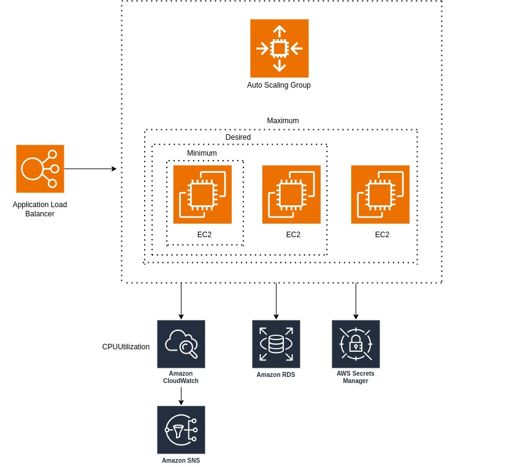

# Implementation

## Security Group
1. Create a security group for the EC2 instances with the internet access.
   

## AMI (Amazon Machine Image)
1. Create an EC2 instance with t2micro (free tier) type with the `user data` from the [ami.sh](user-data/ami.sh). The bash script will install all necessary dependencies and show some basic information to the EC2 Web Server users. 

2. Create AMI from the image.

Note - use the previously created security group for the AMI.

## RDS
1. Create an RDS MySQL Database.
2. Fill in the database.
.
3. Allow the EC2 security group to connect to the database.
.
4. Create Rds Credentials in the AWS Secrets Manager service for the DB.

## ALB Target group and Launch Template
1. Create an ALB Target Group

2. Create a Launch Template. Use the [launch-template.sh](user-data/launch-template.sh) as the `user data` script to show the users table content in the Web Server index page.

## Auto Scaling Group
1. Create an Auto Scaling Group that will auto scale the traffic from 1 to 3 instances to automatically controll the EC2 instances amount based on CPU Utilization.
2. Configure the CPU Utilization to > 60%.
[Auto Scaling group details _ EC2 _ us-east-1.pdf](steps/asg/Auto%20Scaling%20group%20details%20_%20EC2%20_%20us-east-1.pdf).

## Application Load Balancer
1. Create an ALB that will route the traffic to the ASG.

## CloudWatch Alarm
1. Create a CloudWatch Alarm to notify an admin by the email in case CPU Utilization is grater then 80%. During the metric creation create an SNS topic with the admin Email.

2. Confirm the SNS Subscription by the email.

3. Use Apache Benchmark to simulate the traffic and see the Email notification. 

## Diagram

