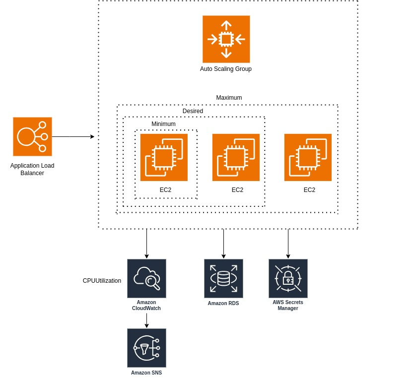

# Scalable Web Application

## Task Description
Deploy a scalable, fault-tolerant web application using AWS services.

## Steps to Implement
- Set up an EC2 Auto Scaling Group behind an Application Load Balancer (ALB).
- Configure an RDS instance for database storage.
- Secure the architecture using IAM roles and Security Groups.
- Implement CloudWatch alarms to monitor performance metrics.
- Simulate traffic using a load testing tool like Apache Benchmark.

## Expected Outputs
- Architecture Diagram (e.g., PNG file)
- Implementation Steps in Detail
- Relevant Code or Configuration Files
- Screenshots of Results or Logs

## Presentation
### Diagram

### Implementation Details
The detailed implementation details and presentation are in the [PRESENTATION.md](PRESENTATION.md)
