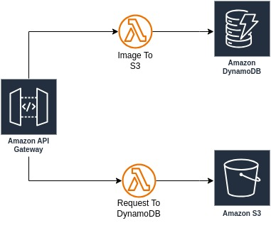

# Implementation Guide

---

## DynamoDB
1. **Create a DynamoDB Table**  
   Follow these steps to create a DynamoDB table:  
     
   

---

## S3
1. **Create an S3 Bucket**  
   Create an S3 bucket for storing files:  
   

2. **Configure Lifecycle Rules**  
   Set up lifecycle policies to optimize storage costs:  
     
     
   

---

## Lambda - Images to S3

1. **Create an IAM Role with Required Policies**
    - Define a policy for Lambda to store images to S3:  
      Policy File: [policy.json](lambda/image/iam-policy/policy.json)  
        
        
      

    - Create the IAM Role:  
        
        
      

2. **Create the Lambda Function**
    - Create a Lambda function to handle image uploads:  
        
      

    - Lambda Code: [script.py](lambda/image/script.py)

---

## Lambda - API Requests to DynamoDB

1. **Create an IAM Role**
    - Create a role that allows Lambda to write data to DynamoDB:  
      

2. **Create the Lambda Function**
    - Set up the Lambda function for API requests:  
        
      

    - Lambda Code: [script.py](lambda/json/script.py)

---

## API Gateway

1. **Create API Gateway Endpoints**
    - Create two endpoints to route requests to Lambda functions:  
        
        
        
        
      

---

## Results

1. **Send Test Requests**
    - Test the endpoints by sending images and JSON requests:

      **Images:**  
        
      

      **JSON Requests:**  
        
      

---

## Architecture Diagram
Visual representation of the architecture:  

