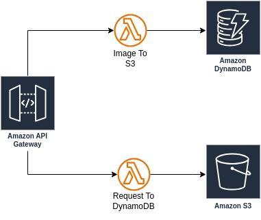

# Serverless Application

## Task Description
Build a serverless application for processing user uploads.

## Steps to Implement
- Use API Gateway to accept user uploads (e.g., JSON data or images).
- Trigger an AWS Lambda function to process the uploads.
- Store processed data in DynamoDB and files in S3.
- Implement lifecycle policies for S3 to optimize costs.
- Document test cases and integration walkthrough.

## Expected Outputs
- Architecture Diagram (e.g., PNG file)
- Implementation Steps in Detail
- Relevant Code or Configuration Files
- Screenshots of Results or Logs

## Presentation
### Diagram

### Implementation Details
The detailed implementation details and presentation are in the [PRESENTATION.md](PRESENTATION.md)
